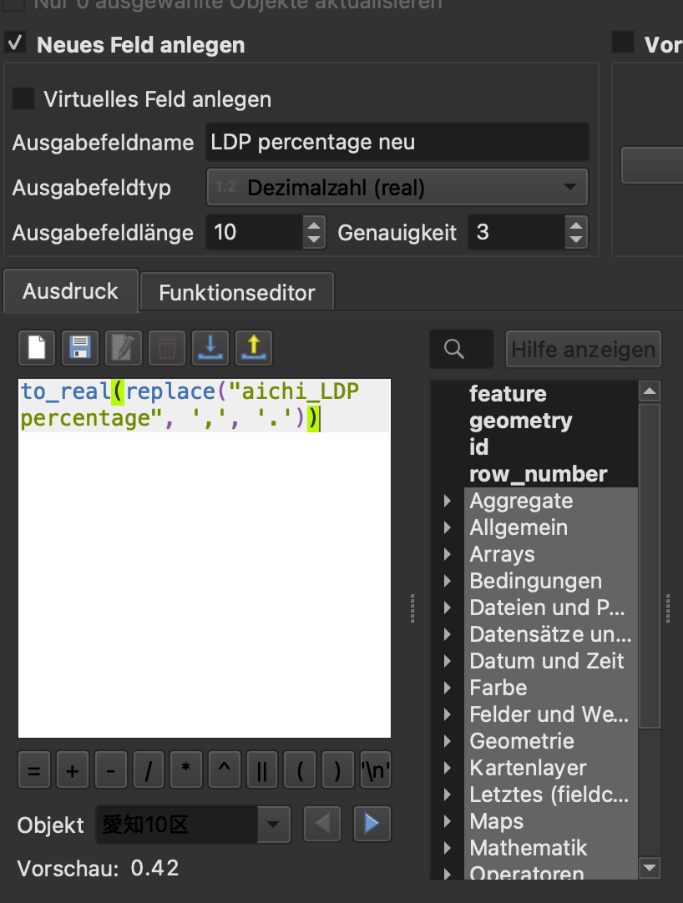
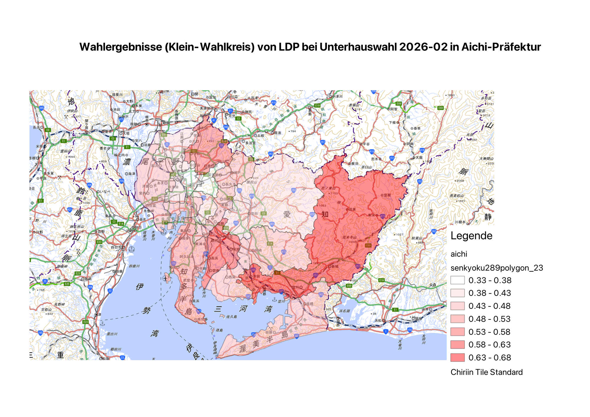

# QGIS für "Japanische Politik"

## Materialien

### Kartengrundlage:
- [Kokudo Chiriin Tile(国土地理院タイル)](https://maps.gsi.go.jp/development/ichiran.html)
- [Open Streep Map](https://wiki.openstreetmap.org/wiki/Raster_tile_providers)
- [衆議院議員選挙の小選挙区の統計データ及び地図データ（ポリゴンデータ）の提供ページ](https://gtfs-gis.jp/senkyoku/)
- [市区町村・選挙区地形データ 表示サンプル Viewer](https://smartnews-smri.github.io/japan-topography/viewer/)
- [市区町村・選挙区地形データ 表示サンプル Github](https://github.com/smartnews-smri/japan-topography)

### Daten (Auswahl)

- [日本-選挙に関する統計](https://ndlsearch.ndl.go.jp/rnavi/politics/post_204111)
- [第51回衆議院議員総選挙・最高裁判所裁判官国民審査結果調（速報）]
(https://www.soumu.go.jp/main_content/001055230.pdf)

第51回衆議院議員総選挙 = Unterhauswahl 2026-02-08

## Beispiel - Anleitung

### Karten einbinden

1. QGIS > Layer > Layer hinzufügen > XYZ-Layer hinzufügen klicken => Ein Popup-Fenster öffnet sich
2. Im Popup-Fenster "XYZ-Verbindungen" "Neu" klicken => Noch ein Popup-Fenster taucht auf
3. In dem 2. Popup-Fenster tragen wir z.B. Chiriin Tile Standard ein. Bitte folgende Information eingeben:

```
Name: Ein beliebiger Name  
URL: https://cyberjapandata.gsi.go.jp/xyz/std/{z}/{x}/{y}.png (laut der Website)  
Minimale Zoom-Stufe: 5  
```

4. Mit OK speichern. Danach kommt man auf die 1. Popup-Fenster zurück
5. Der neu eingetragene Tile aus Pulldown-Menü auswählen und "Hinzufügen" klicken. Die Layer wird dann hinzugefügt

### Vector-Daten hinzufügen
1. Von [市区町村・選挙区地形データ 表示サンプル](https://smartnews-smri.github.io/japan-topography/viewer/) "選挙区" und "愛知県" anwählen
2. Klick "GeoJsonデータをダウンロード". Die Daten wird heruntergeladen
3. Die GeoJson-Daten durch Drag&Drop in QGIS-Layer hinzufügen

### Statistische Daten mit Karteninformation erstellen
1. Aus [第51回衆議院議員総選挙・最高裁判所裁判官国民審査結果調（速報）]
(https://www.soumu.go.jp/main_content/001055230.pdf) eine Tabelle erstellen
2. Die Tabelle (CSV-Format `./assets/aichi_votes_2026.csv`) als Layer in QGIS hochladen
3. Vector-Layer rechts klick > Eigenschaften > "Verknüpfen" > CSV-Layer anwählen und die Tabelle in die Attribut der Vector-Layer hinzufügen
4. Wir wollen die Zahlen von "LDP percentage" visualisieren. Aber die Zahlen in der Tabelle ist als String eingegeben. Deshalb folgende Änderung in QGIS notwendig. Layer rechts klick > "Attributstabelle öffnen" > "Bearbeitungsmodus" einschalten (Bleistift-Symbol) > "Feldrechner öffnen" > Dann so wie hier die Angaben eingeben und "OK" drucken. Dadurch wird eine neue Spalte mit Zahlen erstellt.
Dies ist die Formel:

```
to_real(replace("aichi_LDP percentage", ',', '.'))
```




### Statistiken visualisieren
1. Layer rechts klick > Eigenschaft 
2. Symbolisierung > Ganz oben "Abgestuft" anwählen
3. "LDP percentage neu" bei "Wert" eingeben. Interval-Grösse noch anpassen. "Klassifizieren" klicken

### Visualisierung für die Arbeit exportieren
1. Neue Layout erstellen anwählen
2. Dies und jenes (Karte, Legende und Beschriftung usw.) auf die Fläche importieren
3. Dies als Bild exportieren



